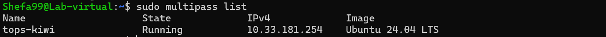
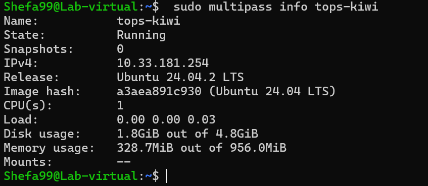
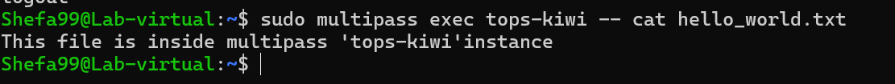
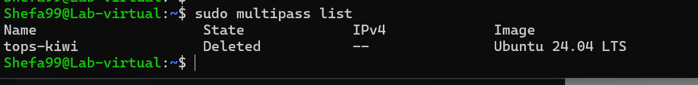
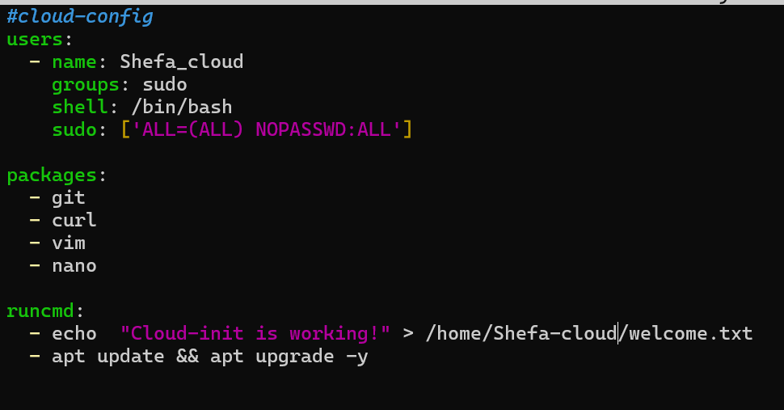
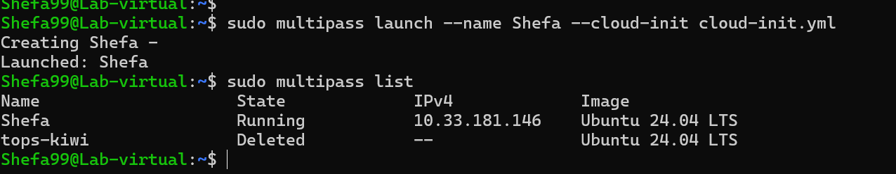
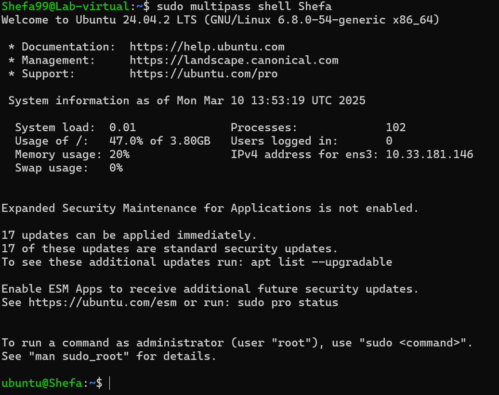
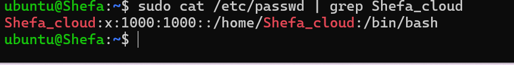
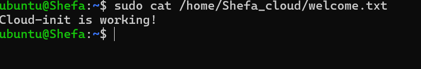

## Linux Virtualization

#### Part 1: Introduction to Virtualization Concepts

**Virtualization–** The process of creating virtual instances of hardware or software resources.

**Hypervisor–** Software that enables virtualization by managing virtual machines (VMs).

**Virtual Machines (VMs) –** Fully isolated computing environments that run on virtualized hardware.

**Containers –** Lightweight virtualization at the OS level that allows multiple applications to run in isolated spaces.

**Main differences between VMs and Containers**
| Virtual Machines  | Containers |
|---------------------|------------|
| Includes full OS, virtual hardware | Shares host OS kernel |
| Requires more resources | Lightweight |
| Strong isolation, each VM runs separately | Process-level isolation |
|  Slightly slower due to full OS overhead | Faster startup  |


#### Part 2: Working with Multipass:
Following the Source Guide
__Source Used:__ [Canonical Install Guide](https://canonical.com/multipass/docs/install-multipass)

__Steps:__

To install multipass:

```
snap install multipass
```
Launching the default Mulitpass ubuntu instance:

```
sudo multipass launch
```
__Reason:__ When running Multipass commands, authentication happens automatically in the background.

Result:


__Listing instances:__
Command: 
```
sudo multipass list
```
Result:


__Multipass instance info:__
Command:
```
sudo multipass info tops-kiwi
```
Result:



__Multipass Shell access:__
Command:
```
sudo multipass shell tops-kiwi
```
Result:


I created a file in the instance home directory and named it 'hello_world.txt'.
Now trying to read the file outside the instance using the cat command.

Command:
```
sudo multipass exec tops-kiwi -- cat hello_world.txt
```
Result:



__Stopping the instace:__

```
sudo multipass stop tops-kiwi
```

__Delete the instance:__

```
sudo multipass delete tops-kiwi
```

```
sudo multipass list
```




__Cloud-init Experiment:__

created the **"cloud-init.yml"** file.



The config file will install some basic packeges and after successfully starting the instance it will return "Cloud-init is working!" from the welcome.txt file which will create after running the first time.

__Commnad:__

```
sudo multipass launch --name cloud-init --cloud-init cloud-init.ym
```

Then accessed shell using

```
sudo multipass shell cloud-init
```

Now checking if the user Shefa_cloud exist. command:
```
cat /etc/passwd | grep Shefa_cloud
```
Result:  welcome.txt
```
sudo cat /home/Shefa_cloud/welcome.txt
```
Result: 

Using sudo because the file was created by root and was accessable by Shefa_cloud.



created a folder in the host machine named "host_machine" and created another folder in instance called "shared_folder". then mounted the folder on the host machine using:
```
sudo multipass mount ~/host_machine cloud-init:/home/ubuntu/shared_folder
```
Creating a test file in the host machine.
```
echo "Hello from the host!" > ~/shared-folder/hostfile.txt
```
### Study
LXD is a next-generation system container manager that provides a user-friendly experience for managing Linux containers. It extends LXC, offering a robust API, CLI tools, and the ability to manage both containers and virtual machines.

**Key Features of LXD**
Image-based: LXD uses prebuilt images for various Linux distributions.
Security: Containers run under an unprivileged user, increasing isolation.
Scalability: LXD supports clustering, making it efficient for managing multiple containers.
Live Migration: Containers can be moved between hosts.
Setup
To install and enable LXD on Ubuntu 24.04, follow these steps:
```
sudo apt update && sudo apt install -y lxd
sudo lxd init
```
During initialization, LXD will prompt for storage, networking, and security configurations.

Below are essential LXD commands to manage containers:
```
lxc launch ubuntu:24.04 my-container
lxc list
lxc exec my-container -- bash
lxc stop my-container
lxc delete my-container
```
Challenges Faced
Storage Backend Configuration: The setup required choosing a storage backend (ZFS, LVM, or directory). Opted for ZFS for better performance.
Network Bridge Setup: Had to manually create a bridge to allow internet access to containers.
How to Stick Apps with Docker

### Installation

To install Docker on Ubuntu 24.04:
```
sudo apt update
sudo apt install -y docker.io
sudo systemctl enable --now docker
```
**Verify installation:**
```
docker --version
```
Basic Concepts

Images: Read-only templates used to create containers.
Containers: Instances of Docker images.
Dockerfile: A script defining how to build an image.
Experiment
To test Docker, I created a simple containerized Nginx server:
```
docker run -d -p 8080:80 --name my-nginx nginx
```
Accessing http://localhost:8080 confirmed it was running successfully.

Challenges Faced
Permission Issues: Initially, needed sudo for Docker commands. Solved by adding the user to the docker group.
```
sudo usermod -aG docker $USER
```
Port Conflicts: Another service was using port 80, so I mapped to 8080 instead.
Snaps for Self-Contained Applications
Research
Snaps are self-contained application packages that include dependencies, allowing for easy deployment across Linux distributions.

Benefits of Snaps
Automatic Updates: Ensures applications stay updated.
Isolation: Snaps run in a sandboxed environment.
Cross-Distro Compatibility: Works across different Linux distributions.
Experiment: Creating a Snap
Installed Snapcraft:
```
sudo snap install snapcraft --classic
```
Created a basic snap package:
```
mkdir my-snap
cd my-snap
snapcraft init
```
Modified snapcraft.yaml to build a simple application. Then, built and installed the snap:
```
snapcraft
sudo snap install my-snap_*.snap --dangerous
```
Verified installation:
```
snap list | grep my-snap
```
Challenges Faced
Dependency Issues: Had to install missing dependencies manually.
Permissions: Required --dangerous flag to install locally built snaps.